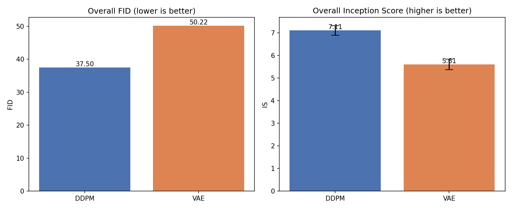

This repo shows the difference between DDPMs and VAEs where both are evaluated using FID and IS scores.

FID score is a metric is calculated by passing a set of real images and fake images into an inception v3 classifier, the final 2048 feature vector before the classification  layer for both sets are extracted and a simimlarity between each set is computed, the used similarity metric used is called FID (Fréchet Inception Distance). FID Treats each set of feature vectors as samples from a multivariate Gaussian and it estimates a mean vector and covariance matrix for the real features and separately for the fake features. the end goal of FID is to show how the feature distribution sits closer to the real one therefore, a lower FID score implies that both distributions are more similar, or the deviation between both distribution is lower.

whereas IS computes how clear a generated image is. and whether it really represents a meaningful object.
it's computed by observing the output layer of passing the generated image through a classifier [Inception v3 in our case] and the more confident Inception-v3 is about it's predictions, the more clear and meaningfull the generated images are, otherwise, if the model keeps producing even/kind-flat probabilty distributions, it'd indicate that the generated images are not really clear.

now, VAEs is trained as an encoder-decoder that takes an input image, passes it through an encoder, and the encoder outputs a mean (mue) and log-variance vectors (log(sigma^2)), than a bunch of random noise is generated, and get normalized using the output mean and log-variance vectors, the noise then gets passed through the decoder. the decoder outputs an image accordingly.
this paradigm ensures a bunch of things, most importantly is that unlike ordinary auto-encoders, you can sample from anywhere in your latent space, all classes are close to each other, the latent space doesnt have empty spaces, so pretty much any sampling will result in meaningful images.

reconstruction loss alone is not enough for training a VAE, because when trained using rec loss only, they tend to output meaningless blurry images.
so the reconstruction loss is often combined with  perceptual and adversarial losses to for the model to output less blurry and more meaningfull images.

on the other hand, DDPM operates by also training an encoder decodrer to iteratively modify input noise to start forming a meaningful picture.
so, during inference, it takes pure noise, and with each pass, the model outputs the the direction of which the noise should go to in order to get closer to a meaningful picutre.
the reason of the sucess behind this paradigm is because going instantly from pure noise to an output image as in VAEs is a very hard process. the distribution of the gaussian noise is too far away from the real-images manifold.
when this process is done iteratively, we start shifting step by step from the gaussian noise to the manifold.
so instead of going from distribution A to the very far distribution B in one take, the diffusion process allows the model to take better steps toward distribution B.

the following table shows the overall FID and IS scores of each models 
## Overall FID & IS Comparison

| Model | FID ↓ | IS (mean ± std) ↑ |
|-------|-------:|------------------:|
| DDPM | 37.504 | 7.109 ± 0.214 |
| VAE | 50.219 | 5.605 ± 0.237 |

and this table shows the FID and IS scores per class for each model.
## Per-Class FID & IS Comparison

| Class | DDPM FID ↓ | DDPM IS ↑ | VAE FID ↓ | VAE IS ↑ |
|-------|-----------:|----------:|----------:|---------:|
| airplane | 111.10 | 4.67 | 113.14 | 3.53 |
| automobile | 82.72 | 3.58 | 124.04 | 3.09 |
| bird | 117.00 | 4.47 | 112.54 | 3.65 |
| cat | 110.75 | 4.00 | 124.78 | 3.57 |
| deer | 97.93 | 4.48 | 103.43 | 3.31 |
| dog | 117.58 | 4.49 | 124.52 | 3.90 |
| frog | 85.43 | 3.79 | 106.63 | 2.77 |
| horse | 85.94 | 4.22 | 137.75 | 4.06 |
| ship | 101.29 | 4.30 | 85.35 | 3.05 |
| truck | 89.30 | 3.29 | 125.78 | 3.27 |

as the numbers show, DDPM has better lower FID and higher IS scores compared to VAE, meaning that DDPM generates images closer to that of the actual images manifold. again, the distribution process helps transitioning from dist A to B easily and more confidently. this also means that the images generated by DDPM are more meaningful and have actual objects in it, not some random stuff that pretend to be objects.

finally, here are some visuals showing how both models perform

*Figure 1. Overall FID and Inception Score comparison between the DDPM and VAE models.*